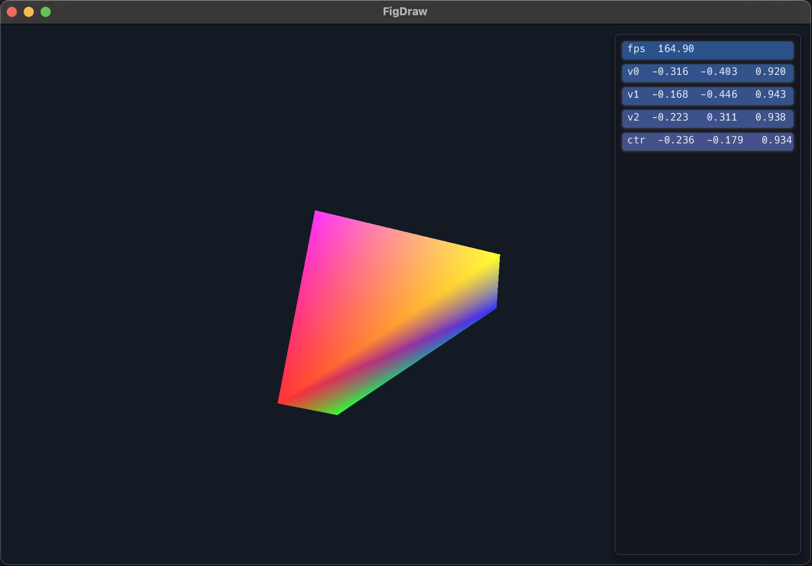
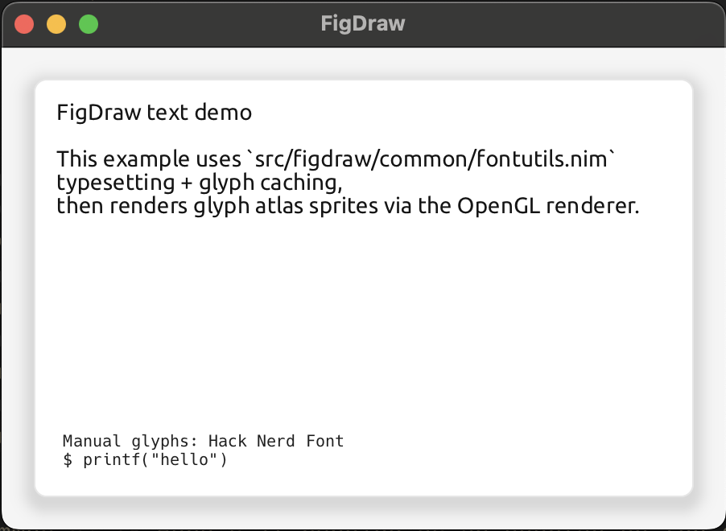

# FigDraw

`figdraw` is a pure Nim rendering library for building and rendering 2D scene graphs
(`Fig` nodes) with a focus on:

- A thread-safe renderer pipeline (render tree construction and preparation can be done off the main thread; OpenGL submission stays on the GL thread).
- An OpenGL backend with SDF (signed-distance-field) primitives for crisp rounded-rect rendering and gaussian based shadows.
- Modern and fast text rendering and layout using [Pixie](https://github.com/treeform/pixie/) with a thread-safe API.
- Image rendering using an OpenGL Atlas.
- Supports layering and multiple "roots" per layer - great for menus, overlays, etc.
- Lightweight and high performance by design! Low allocations for each frame.

## What's It Look Like?

Here's the primary rounded rect primitive with corners, borders, and shadows:


Here's it running as an overlay on top of a 3D scene:



Here's text rendering curtesy of Pixie. Note that Pixie's layout can be used or custom layout, e.g. for monospaced renderers:



Here's a video example (unfortunately capped at 30fps) of real time shadows, borders, and corners chaning fluidly at 120 FPS:

https://github.com/user-attachments/assets/aca4783c-86c6-4e52-9a16-0a8556ad1300

## Status

This repo is still under development but the core support for SDF is running! 
OpenGL backend is the only supported renderer right now
(`src/figdraw/opengl/`). However there's some work toward supporting Vulkan.

Future directions may include adding support for SDF textures for text rendering using Valve's SDF-text mapping technique. Other directions in that area would be supporting vector images rasterized to SDF textures as well. 

The next big item is hopefully setting up some examples of doing WebGL version with Windy.

Finally there will be a C API and a setup to compile FigDraw as a shared library. 

## Requirements

- Nim `>= 2.0.10` (ARC/ORC-based memory managers; required by `src/figdraw/common/rchannels.nim`)
- OpenGL (desktop GL by default; GLES/emscripten shader paths via `-d:useOpenGlEs` and/or `-d:emscripten`)

## Quick Start

This part assumes a recent Atlas (>= 0.9.6) version:

```sh
# Try the repo:
git clone https://github.com/elcritch/figdraw
cd figdraw
atlas install --feature:windy --feature:sdl2

# Run an example:
nim c -r examples/opengl_windy_renderlist.nim
```

```sh
# Use as a dependency (in your own project):
atlas use https://github.com/elcritch/figdraw
```

Alternatively Nimble should work as well:
```sh
nimble install https://github.com/elcritch/figdraw
```

## Using Library

The most stable entry points today are:

- Core types/utilities: `import figdraw/commons`
- Scene graph nodes: `import figdraw/fignodes`
- OpenGL backend: `import figdraw/opengl/renderer`

Render list example (build a small scene tree):

```nim
import figdraw/commons
import figdraw/fignodes
import chroma

proc makeRenders(w, h: float32): Renders =
  var list = RenderList()

  let rootIdx = list.addRoot(Fig(
    kind: nkRectangle,
    screenBox: rect(0, 0, w, h),
    fill: rgba(255, 255, 255, 255).color,
  ))

  list.addChild(rootIdx, Fig(
    kind: nkRectangle,
    screenBox: rect(80, 60, 240, 140),
    fill: rgba(220, 40, 40, 255).color,
    corners: [12.0'f32, 12.0, 12.0, 12.0],
    stroke: RenderStroke(weight: 3.0, color: rgba(0, 0, 0, 255).color),
  ))

  result = Renders(layers: initOrderedTable[ZLevel, RenderList]())
  result.layers[0.ZLevel] = list
```

Feed the resulting `Renders` into the OpenGL backend; see the examples below for a full render loop.

For a complete working example (window + GL context + render loop), see:

- `examples/opengl_windy_renderlist.nim`
- `examples/sdl2_renderlist.nim`

For a Nim JS + WebGL example (no Windy), see:

- `examples/webgl_renderlist.nim` (paired with `examples/webgl_renderlist.html`)

## Run Tests

Runs all tests + compiles all examples listed in `config.nims`:

```sh
nim test
```

Run a single test:

```sh
nim r tests/trender_rgb_boxes.nim
```

## SDF Rendering (default)

The OpenGL backend renders rounded rectangles and shadows using an SDF shader
path by default:

```sh
nim r examples/opengl_windy_renderlist.nim
```

To force the older texture path, compile with `-d:useFigDrawTextures`.

Notes:

- The main OpenGL shader combines atlas sampling and SDF rendering, switching per-draw via an `sdfMode` attribute (no shader swaps for SDF vs atlas).
- Masks still use a separate mask shader program.
- Current SDF modes include clip/AA fills, annular (outline) modes, and drop/inset shadow modes used by the renderer.

## Useful Defines

- `-d:figdraw.names=true`: enables `Fig.name` for debugging (enabled for tests in `tests/config.nims`)
- `-d:useOpenGlEs`: select GLES/emscripten shader sources when GLSL 3.30 is not available
- `-d:useFigDrawTextures`: force the legacy texture-based shape rendering path (disables SDF shapes)
- `-d:openglMajor=3 -d:openglMinor=3`: override the requested OpenGL version (see `src/figdraw/utils/glutils.nim`)

## Thread Safety Notes

- Rendering is structured so that preparing render lists/trees can be done off-thread.
- GPU resource submission (OpenGL calls) must happen on the GL thread; the backend enforces this separation.

## License

See `LICENSE`.
